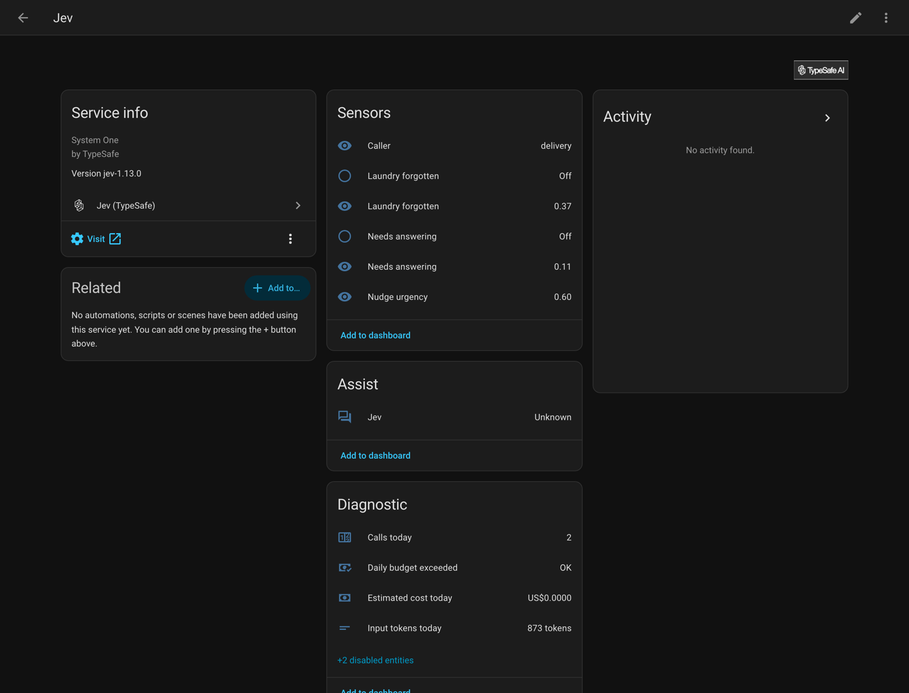

[](https://github.com/AboveColin/HA-Jev/actions/workflows/tests.yaml)
[](https://github.com/AboveColin/HA-Jev/actions/workflows/hassfest.yaml)
[](https://github.com/AboveColin/HA-Jev/actions/workflows/hacs.yaml)
[](https://github.com/hacs/integration)
[](https://www.home-assistant.io/)
[](https://github.com/AboveColin/HA-Jev/releases)
[](LICENSE)

# Jev for Home Assistant

Ask [TypeSafe Jev](https://typesafe.ai) questions about your house and get numbers
back. Jev is a decision model, not a chat model. It answers a typed question with a
probability, a choice or a score, and this integration turns each answer into an
entity you can automate on.

**[Full documentation](https://jev.cdevries.dev)**

Not affiliated with TypeSafe. The API client is
[jevclient](https://github.com/AboveColin/jevclient).



## What it does

- [Questions](https://jev.cdevries.dev/questions-ui/) become sensors: a probability,
  one of your options with its distribution, or a number on a scale. Add them in the
  UI, [in YAML](https://jev.cdevries.dev/questions-yaml/), or both.
- Four [actions](https://jev.cdevries.dev/actions/), `jev.noul`, `jev.choice`,
  `jev.score` and `jev.ask`, answer inside an automation and return a response
  variable.
- An [AI Task](https://jev.cdevries.dev/ai-task/) entity answers
  `ai_task.generate_data` when it is called. A boolean, select or number field
  becomes the matching question.
- A [conversation agent](https://jev.cdevries.dev/conversation/) for Assist routes
  spoken commands through the same model.
- It [reports what it spends](https://jev.cdevries.dev/cost/): calls, input tokens and
  estimated cost per day, against a daily token budget.
- Fifteen worked [examples](examples/), four of them pairing Jev with an LLM.

```yaml
automation:
  - alias: Remind about the washing
    triggers:
      - trigger: state
        entity_id: binary_sensor.jev_laundry_forgotten
        to: "on"
        for: "00:10:00"
    actions:
      - action: notify.mobile_app
        data:
          message: The washing is done and still in the machine.
```

## Installation

Requires Home Assistant 2026.9 or newer and an API key from
[typesafe.ai](https://typesafe.ai).

### HACS

Jev is not in the HACS default list, so add it as a custom repository once.

1. HACS, then the three dot menu, then **Custom repositories**.
2. Paste `https://github.com/AboveColin/HA-Jev`, set Type to **Integration**, **Add**.
3. Search HACS for **Jev**, then **Download**.
4. Restart Home Assistant.

[](https://my.home-assistant.io/redirect/hacs_repository/?owner=AboveColin&repository=HA-Jev&category=integration)

### Manual

Copy `custom_components/jev` from the
[latest release](https://github.com/AboveColin/HA-Jev/releases/latest) into your
`config/custom_components/` directory and restart. HACS does not update a copy
installed this way.

## Setup

Settings, Devices and services, Add integration, then **Jev (TypeSafe)**. Enter your
API key. The address field already holds the TypeSafe API.

[](https://my.home-assistant.io/redirect/config_flow_start/?domain=jev)

To use an OpenRouter key, set the address to `https://openrouter.ai/api` and the model
to `~typesafe/jev-latest`. The [install page](https://jev.cdevries.dev/install/) has
every option, and how to point the integration at a proxy.

Then [ask your first question](https://jev.cdevries.dev/first-question/).

## Documentation

| Page | What it covers |
|---|---|
| [The three answers](https://jev.cdevries.dev/primitives/) | noul, choice and score, and what confidence means |
| [Writing a question that works](https://jev.cdevries.dev/writing-questions/) | how to tell it to read the numbers, and asking one thing at a time |
| [What it costs](https://jev.cdevries.dev/cost/) | what questions and calls cost, and the daily budget |
| [Measurements](https://jev.cdevries.dev/measurements/) | what was measured against the live API |
| [Troubleshooting](https://jev.cdevries.dev/troubleshooting/) | symptoms and their causes |
| [Limitations](https://jev.cdevries.dev/limitations/) | what it cannot do, and what it is not for |

## Contributing

Issues and pull requests are welcome. [AGENTS.md](AGENTS.md) has the rules and the full
check a change must pass.

Use Python 3.14. The pinned `pytest-homeassistant-custom-component` requires it, and
3.13 fails at install with "No matching distribution found".

```bash
pip install -r requirements-test.txt
pytest
```

The tests run the integration inside a real Home Assistant with the API client
replaced, so the suite spends nothing.

## Changelog

See the [release history](https://github.com/AboveColin/HA-Jev/releases).
